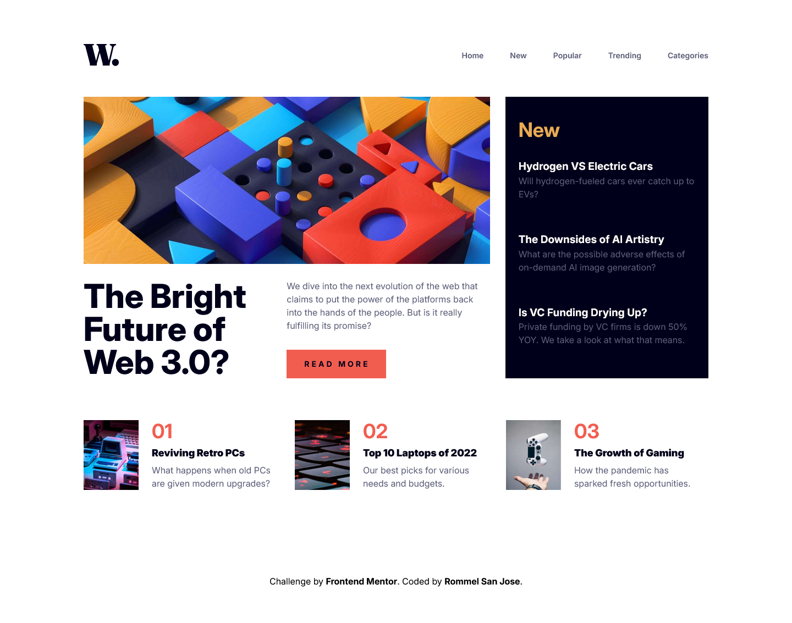

# Frontend Mentor - News homepage solution

This is a solution to the [News homepage challenge on Frontend Mentor](https://www.frontendmentor.io/challenges/news-homepage-H6SWTa1MFl). Frontend Mentor challenges help you improve your coding skills by building realistic projects.

## Table of contents

## Overview

This project is responsive and includes functional mobile navigation component. The site features clean layout. All created using HTML, TailwindCSS and TypeScript.

### The challenge

Users should be able to:

- View the optimal layout for the interface depending on their device's screen size
- See hover and focus states for all interactive elements on the page

### Screenshot

### Links

- Solution URL: [Add solution URL here](https://your-solution-url.com)
- Live Site URL: [Add live site URL here](https://your-live-site-url.com)

### Built with

- Semantic HTML5 markup
- Flexbox
- CSS Grid
- [Vite](https://vite.dev/) - Build tool
- [TypeScript](https://www.typescriptlang.org/) - A Superset of JavaScript
- [TailwindCSS](https://tailwindcss.com/) - CSS framework

**Note: These are just examples. Delete this note and replace the list above with your own choices**

### What I learned

- **CSS Grid:** I gained a deeper understanding of CSS Grid, especially how it automatically creates templates for rows and columns even when they're not explicitly defined.
- **JavaScript Toggle Functionality:** I improved my understanding of the `toggle` method and its quirks, especially when it comes to manipulating class names and using conditional logic to manage state. I also learned how to manage toggling behaviors in a way that ensures smooth user interactions.
- **ARIA Attributes:** I learned more about ARIA (Accessible Rich Internet Applications) attributes, such as `aria-expanded` and `aria-hidden`, and how they help improve accessibility. By using these attributes properly, I ensured that the mobile navigation is accessible to users with screen readers and other assistive technologies.

## Author

- Rommel San Jose
- Frontend Mentor - [@47roms16](https://www.frontendmentor.io/profile/47roms16)
